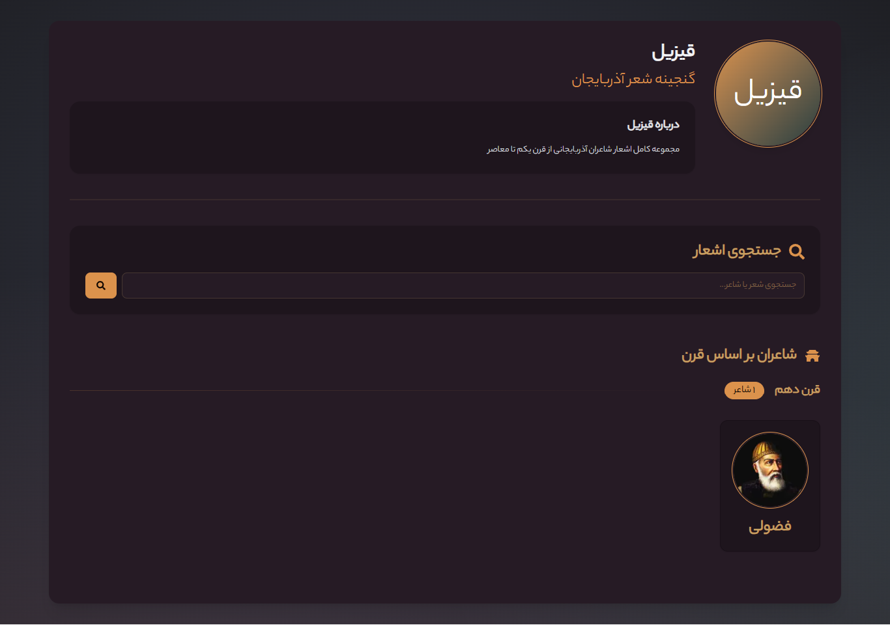
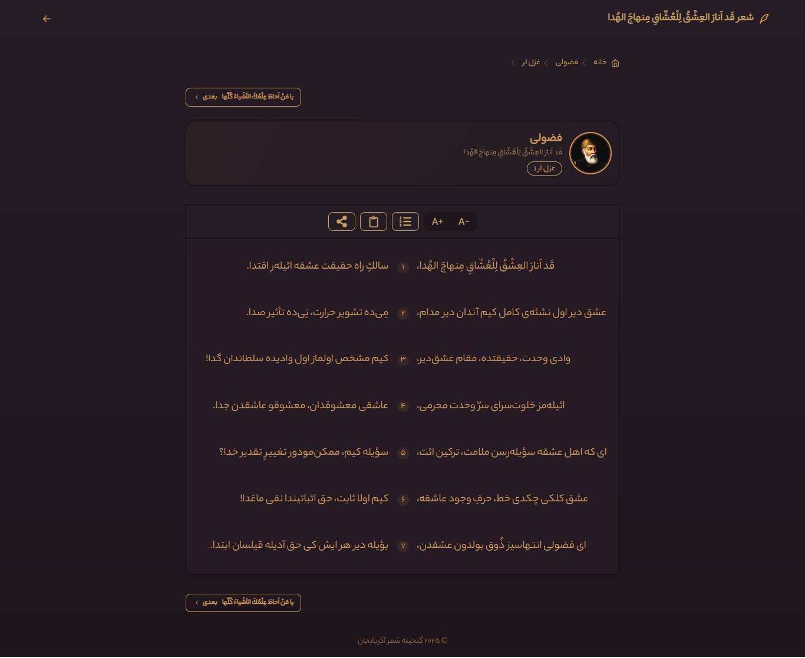

# 📚 Azerbaijani Poets Digital Archive

<p align="center">
  
  
  
  

  <br>
  <h1 align="center" dir="rtl">شاعران آذربایجانی | Azerbaijani Poets</h1>
  <p align="center">A cultural treasury of Azerbaijani literary heritage spanning centuries of poetic tradition</p>
  
  <p align="center">
    
    
    
    
  </p>
</p>

---

## 🌟 Project Features
<p align="right" dir="rtl">
  <strong>ویژگی‌های پروژه</strong>
</p>

### 📖 Comprehensive Poet Profiles
Detailed biographies, works, and analysis of prominent Azerbaijani poets throughout history

### 🗂️ Historical Organization
Categorized by literary periods and movements with interactive timelines

### 🔍 Advanced Search
Find poets by name, era, literary style, or even poetic themes

### 🎧 Multimedia Content
Audio readings of poems with traditional Azerbaijani musical accompaniment

### 📱 Fully Responsive
Optimized experience across all devices with adaptive layouts

### 🎨 Cultural Design
Authentic Azerbaijani motifs and Persian calligraphy elements

---

## 🛠️ Technology Stack
<p align="right" dir="rtl">
  <strong>فناوری‌های استفاده شده</strong>
</p>

| Technology | Description |
|------------|-------------|
|  **Next.js 15** | App Router, Server Components |
|  **React 19** | With Concurrent Features |
|  **Prisma 5.0** | Type-safe Database ORM |
|  **Tailwind 4.0** | Utility-first CSS Framework |
|  **DaisyUI 5** | Component Library |
|  **TypeScript** | Type Safety |

---

## 🚀 Getting Started
<p align="right" dir="rtl">
  <strong>راه‌اندازی پروژه</strong>
</p>

```bash
# Clone the repository
git clone https://github.com/mrsedghi/qizil.git

# Install dependencies
npm install

# Set up environment variables
cp .env.example .env

# Run database migrations
npx prisma migrate dev

# Start development server
npm run dev
```

## 🌐 Live Demo
<div dir="rtl" align="right">
  
### نسخه آنلاین
</div>

<div align="center">
  <a href="https://qizil.vercel.app" target="_blank">
    
    <p>https://qizil.vercel.app</p>
  </a>
</div>

---


## 🤝 Contributing
<p align="right" dir="rtl">
  <strong>مشارکت در پروژه</strong>
</p>

### 👥 How to Contribute
1. 🍴 Fork the repository
2. 🌿 Create a new branch: `git checkout -b feature/AmazingFeature`
3. ✏️ Make your changes
4. 📤 Push to the branch: `git push origin feature/AmazingFeature`
5. 🔄 Open a Pull Request

<p align="right" dir="rtl">
  
### راهنمای مشارکت
1. پروژه را فورک کنید
2. یک برنچ جدید ایجاد کنید
3. تغییرات خود را اعمال کنید
4. پول ریکوئست ارسال کنید
5. منتظر بررسی بمانید
</p>

---


## 💖 Support
<div dir="rtl" align="right">
  
### حمایت از پروژه
</div>

<div style="display: grid; grid-template-columns: repeat(auto-fit, minmax(300px, 1fr)); gap: 2rem; margin-top: 1rem;">

<div>

###  Iranian Support
<a href="http://www.coffeete.ir/m.r.sedghii" target="_blank">
  
</a>

</div>

<div>

### 💳 Crypto Donations


 **TRX**:  
`TXkEs7BHRtV6ffof79Ty92AJW1jYrFRUSY`

</div>

</div>

<div align="center" style="margin-top: 1rem;">
  <p><i>Your support helps maintain and improve this project! ❤️</i></p>
</div>

---

## 📜 License
<div dir="rtl" align="right">
  
### مجوز پروژه
</div>

<div align="center">
  
  <p>This project is licensed under the MIT License - see the <a href="LICENSE">LICENSE</a> file for details.</p>
</div>

---

## 📬 Contact
<div dir="rtl" align="right">
  
### تماس با ما
</div>

<div style="display: grid; grid-template-columns: repeat(auto-fit, minmax(200px, 1fr)); gap: 1rem;">

<div>

**MohammadReza Sedghi**  
<small>Project Maintainer</small>

</div>

<div>

-  [@mrsedghi](https://t.me/mrsedghi)
-  m.r.sedghii@gmail.com
-  [mrsedghi](https://github.com/mrsedghi)

</div>

</div>

---

<div align="center" style="margin-top: 2rem;">
  
  
  <p>Made with ❤️ and ☕ in Azerbaijan | ساخته شده با عشق در آذربایجان</p>
</div>
